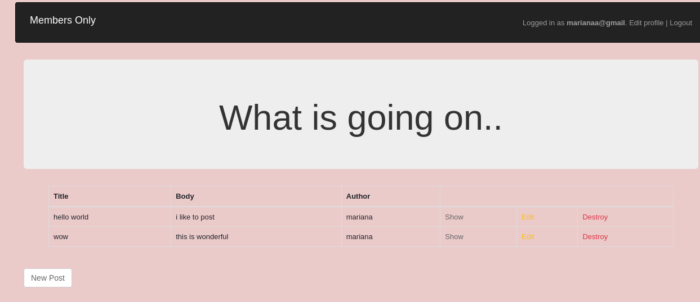
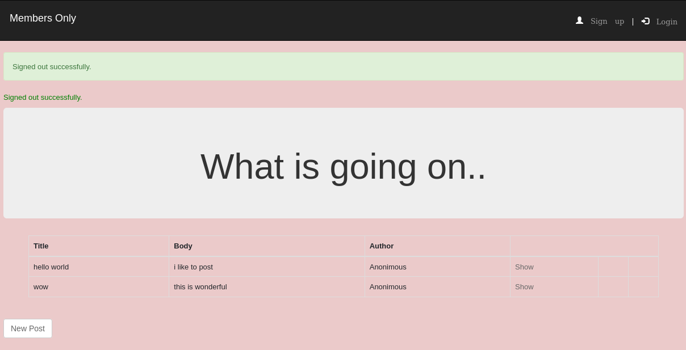

# README

This assignment consists of using the Devise gem to have a first approach at authentication in rails. You will build an application that allows users to create posts and the authors of the posts are displayed only if as a User you are logged in.

## Built With

* Ruby 2.7.2
* Ruby on Rails 6.1.1
* 'sqlite3', '~> 1.4'
* 'devise', '~> 4.7', '>= 4.7.2'

## Setup

- To run it in your local machine you need to follow these steps.

 - Clone repository repository with this command on terminal
  git clone git@github.com:atenaiis/members-only.git

## Run
 - Once you are in your local directory, open your console and run:

 - bundle install
 - rails db:create 
 - rails db:migrate

 - rails server

## You can use the general commands to create objects or get them.

To set up the server.

After this you can open your favorite web-browser and copy paste the next:

http://localhost:3000/

## Authors

👤 **Author1**

- Github: [@atenaiis](https://github.com/atenaiis)
- Twitter: [@spranomarian](https://twitter.com/SopranoMarian)
- Linkedin: [linkedin](https://www.linkedin.com/in/mariana-atenai-campos-garcia-a30791143/)

## 🤝 Contributing

Contributions, issues and feature requests are welcome!

## Show your support

Give a ⭐️ if you like this project!

## Acknowledgments

- Hat tip to anyone whose code was used
- Inspiration
- etc